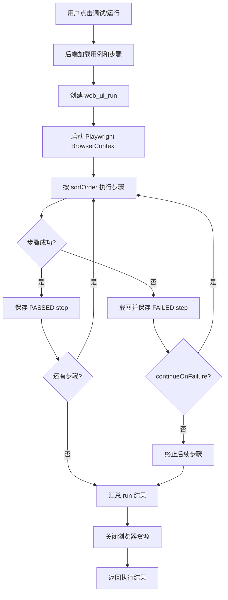

# Web UI 自动化一期设计方案：手工步骤闭环

## 1. 结论

Web UI 自动化一期采用“手工编写步骤”方案，不做录制器、不直接上传脚本、不同时支持多执行引擎。

一期目标是形成最小但真实可用的闭环：

```text
创建 Web UI 用例 -> 编辑步骤 -> 调试运行 -> 保存执行记录 -> 查看步骤报告与截图
```

执行引擎优先采用 Playwright。默认使用无头模式运行，调试场景预留可视化运行配置。

本方案基于当前系统现状设计：

- 前端已有 `/automation/web` 菜单入口，但当前仍是占位页。
- 后端已有较完整的 `apiautomation` 包，可作为模块边界、工作空间、分页、统一响应、执行记录设计的参照。
- 系统已有工作空间、用户、配置中心、缺陷、接口自动化等基础能力，Web UI 自动化不重复建设这些通用能力。

本仓库已有 `docs/web-ui-automation-design-proposal.md`，那份文档更偏早期分期方案，建议一期先接任务/报告壳子。本文件是当前确认“手工编写步骤”为一期目标后的收敛版设计，后续实现应以本文件的一期范围为准。

## 2. 一期范围

### 2.1 做什么

一期只做 Web UI 自动化最核心的用例执行链路：

- Web UI 用例列表
- Web UI 用例新增、编辑、删除
- 手工步骤编辑器
- 步骤调试运行
- 整条用例运行
- 执行记录列表
- 执行记录详情
- 步骤级结果、耗时、错误信息、截图查看
- 工作空间隔离
- 基础环境配置，如 baseUrl、浏览器类型、无头/可视化配置

### 2.2 不做什么

以下能力不进入一期：

- 浏览器录制器
- AI 自动生成 Web UI 步骤
- AI 定位器自愈
- AI 失败诊断
- Selenium、Cypress 多引擎适配
- 分布式浏览器执行集群
- 复杂条件分支、循环、参数化矩阵
- 视频、Trace、HAR、DOM 快照全量归档
- 独立定时调度系统

这些能力可以作为二期、三期扩展。不能在一期一起塞进来，否则数据模型、执行服务、文件存储、安全策略都会明显膨胀。

## 3. 产品形态

### 3.1 页面入口

沿用现有路由：

```text
/automation/web
```

页面名称：

```text
Web UI 自动化
```

页面整体保持与接口自动化模块一致的中台结构：

```text
顶部工作空间上下文
统计卡片
筛选区
Tabs：用例列表 / 执行记录 / 环境配置
主表格
详情抽屉 / 编辑抽屉 / 调试面板
```

### 3.2 用例列表

列表字段建议：

- 用例名称
- 所属模块
- 起始地址
- 浏览器
- 步骤数
- 最近执行结果
- 最近执行时间
- 所属工作空间
- 操作：详情、编辑、调试、运行、删除

筛选条件：

- 关键字
- 所属模块
- 最近结果
- 浏览器

### 3.3 用例编辑器

一期采用表格式步骤编辑器，不做拖拽画布。

编辑器结构：

```text
基本信息
运行配置
步骤列表
调试运行结果
```

步骤列表支持：

- 新增步骤
- 删除步骤
- 上移、下移
- 启用、禁用
- 复制步骤
- 单步调试

### 3.4 执行记录

执行记录列表字段：

- 用例名称
- 执行状态
- 浏览器
- 运行模式
- 耗时
- 通过步骤数 / 总步骤数
- 失败摘要
- 操作人
- 开始时间
- 操作：详情、重新运行、创建缺陷

执行详情展示：

- 执行摘要
- 每一步状态、耗时、输入参数、错误信息
- 失败步骤截图
- 运行日志

## 4. 步骤模型

### 4.1 一期支持的步骤类型

一期只保留高频、稳定、易解释的步骤类型：

| 类型 | 说明 | 是否需要定位器 | 是否需要输入值 |
| --- | --- | --- | --- |
| `OPEN` | 打开页面 | 否 | 是，URL 或相对路径 |
| `CLICK` | 点击元素 | 是 | 否 |
| `FILL` | 输入文本 | 是 | 是 |
| `CLEAR` | 清空输入框 | 是 | 否 |
| `WAIT_FOR` | 等待元素出现 | 是 | 否 |
| `ASSERT_VISIBLE` | 断言元素可见 | 是 | 否 |
| `ASSERT_TEXT` | 断言元素文本 | 是 | 是 |
| `SCREENSHOT` | 截图 | 否 | 否 |

暂不支持复杂脚本步骤。脚本步骤能力强，但会带来安全、沙箱、调试和权限问题，适合后续单独设计。

### 4.2 定位器类型

一期支持 Playwright 常用定位方式：

| 类型 | 示例 |
| --- | --- |
| `CSS` | `.login-button` |
| `TEXT` | `登录` |
| `ROLE` | `button:登录` |
| `PLACEHOLDER` | `请输入用户名` |
| `LABEL` | `用户名` |
| `TEST_ID` | `submit-login` |
| `XPATH` | `//button[text()='登录']` |

推荐优先级：

```text
TEST_ID > ROLE > LABEL / PLACEHOLDER > TEXT > CSS > XPATH
```

前端编辑器可以在定位器旁边提示推荐级别，但一期不强制。

### 4.3 步骤通用字段

每个步骤建议包含：

```json
{
  "id": 1,
  "name": "点击登录按钮",
  "type": "CLICK",
  "locatorType": "ROLE",
  "locatorValue": "button:登录",
  "inputValue": null,
  "timeoutMs": 5000,
  "continueOnFailure": false,
  "screenshotPolicy": "ON_FAILURE",
  "enabled": true,
  "sortOrder": 10
}
```

截图策略：

- `NONE`：不截图
- `ON_FAILURE`：失败时截图，默认值
- `ALWAYS`：每步都截图

## 5. 后端设计

### 5.1 模块边界

新增后端包：

```text
com.company.autoplatform.webuiautomation
```

不要把 Web UI 自动化逻辑塞入 `apiautomation` 包。接口自动化可以作为模式参考，但二者执行模型不同。

建议后端内部拆分：

```text
WebUiAutomationController
WebUiAutomationService
WebUiCaseDomainService
WebUiExecutionService
WebUiPlaywrightRunner
WebUiRunResultPersistenceSupport
WebUiAutomationModels
```

### 5.2 API 路径

统一使用：

```text
/api/automation/web
```

一期接口建议：

```text
GET    /api/automation/web/cases
GET    /api/automation/web/cases/{id}
POST   /api/automation/web/cases
PUT    /api/automation/web/cases/{id}
DELETE /api/automation/web/cases/{id}

POST   /api/automation/web/cases/{id}/debug-run
POST   /api/automation/web/cases/debug-run

GET    /api/automation/web/runs
GET    /api/automation/web/runs/{id}
GET    /api/automation/web/runs/{id}/steps
GET    /api/automation/web/runs/{id}/artifacts/{artifactId}/download

GET    /api/automation/web/environments
POST   /api/automation/web/environments
PUT    /api/automation/web/environments/{id}
DELETE /api/automation/web/environments/{id}
```

所有请求沿用现有工作空间头：

```text
X-Workspace-Code
```

### 5.3 数据表

一期建议新增表：

```text
web_ui_case
web_ui_case_step
web_ui_run
web_ui_run_step
web_ui_run_artifact
web_ui_environment
```

不建议一期复用现有 `tasks/reports` 表承载 Web UI 用例步骤。原因是 Web UI 自动化的核心资产是步骤、定位器、执行截图和步骤结果，强行塞进通用任务报告模型会让后续扩展很别扭。

现有任务/报告中心可以后续接入“聚合视图”，但 Web UI 自动化自身应有独立资产模型。

### 5.4 表字段草案

`web_ui_case`：

```text
id
workspace_id
module_name
name
description
base_url
browser_type
headless
default_timeout_ms
status
last_run_result
last_run_at
created_by
updated_by
created_at
updated_at
```

`web_ui_case_step`：

```text
id
case_id
name
step_type
locator_type
locator_value
input_value
timeout_ms
continue_on_failure
screenshot_policy
enabled
sort_order
created_at
updated_at
```

`web_ui_run`：

```text
id
workspace_id
case_id
case_name
status
browser_type
headless
base_url
total_steps
passed_steps
failed_steps
skipped_steps
duration_ms
failure_summary
operator
started_at
finished_at
created_at
```

`web_ui_run_step`：

```text
id
run_id
case_step_id
step_name
step_type
status
locator_type
locator_value
input_value_snapshot
duration_ms
error_message
screenshot_artifact_id
sort_order
started_at
finished_at
created_at
```

`web_ui_run_artifact`：

```text
id
run_id
step_id
artifact_type
file_name
content_type
file_size
storage_path
created_at
```

`web_ui_environment`：

```text
id
workspace_id
name
base_url
browser_type
headless
default_timeout_ms
status
created_at
updated_at
```

## 6. Playwright 执行设计

### 6.1 技术选型

一期推荐后端直接接入 Playwright Java。

理由：

- 当前后端是 Spring Boot，Java Playwright 能直接嵌入现有服务。
- 不需要额外维护 Node 执行器进程。
- 更容易复用当前认证、工作空间、日志、异常处理、持久化方式。
- 一期步骤类型简单，Java Playwright 足够覆盖。

后续如果出现执行隔离、并发规模、浏览器集群需求，再考虑独立 Node runner 或执行节点服务。

### 6.2 运行模式

一期支持字段：

```text
headless: true / false
```

默认：

```text
headless = true
```

可视化运行只作为调试配置预留，不作为服务器部署默认模式。服务器环境没有桌面会话时，可视化模式可能不可用，前端要给出提示。

### 6.3 执行流程



### 6.4 失败处理

失败结果至少保存：

- 步骤名称
- 步骤类型
- 定位器类型和值
- 错误信息
- 耗时
- 截图

常见失败类型：

- 页面打开失败
- 元素未找到
- 元素不可点击
- 输入失败
- 断言失败
- 超时
- 浏览器启动失败

前端不要只展示“执行失败”，要展示失败步骤和失败原因。

## 7. 前端设计

### 7.1 目录结构

建议按当前新前端分层方式新增：

```text
src/
  entities/
    web-ui-automation/
      api/
      model/
      lib/
      ui/
  features/
    web-ui-case-create-edit/
    web-ui-case-delete/
    web-ui-case-run/
    web-ui-environment-create-edit/
  widgets/
    web-ui-case-workspace/
    web-ui-case-table/
    web-ui-case-editor/
    web-ui-run-table/
    web-ui-run-detail-drawer/
    web-ui-environment-panel/
  pages/
    automation-web/
      WebAutomationPage.vue
```

### 7.2 页面组件

`WebAutomationPage.vue` 只负责页面壳、工作空间加载和模块组合，不承载复杂业务。

核心组件：

- `WebUiCaseWorkspace`：页面主体
- `WebUiCaseTable`：用例列表
- `WebUiCaseEditor`：用例和步骤编辑
- `WebUiRunTable`：执行记录列表
- `WebUiRunDetailDrawer`：执行详情
- `WebUiEnvironmentPanel`：环境配置

### 7.3 编辑器交互

编辑器采用抽屉或页面级编辑均可。一期推荐抽屉：

- 新建/编辑入口轻
- 不破坏列表上下文
- 和当前系统大量抽屉式详情习惯一致

当步骤较多后，可以二期升级为独立编辑页。

### 7.4 校验规则

前端基础校验：

- 用例名称必填
- `OPEN` 步骤必须填写 URL 或路径
- 需要定位器的步骤必须填写定位器类型和值
- `FILL`、`ASSERT_TEXT` 必须填写输入值
- 超时时间建议范围：`1000 - 60000`
- 至少有一个启用步骤才能运行

后端仍必须重复校验，不能只依赖前端。

## 8. 与现有系统的关系

### 8.1 复用能力

复用：

- 登录态
- 工作空间
- 统一响应结构
- 分页结构
- 用户信息
- 缺陷创建入口
- 前端 AppLayout、AppPage、Element Plus 风格
- 现有 API 自动化模块的分层方式

### 8.2 不复用的能力

不直接复用接口自动化的请求配置、断言、变量解析和执行器。Web UI 自动化可以参考它们的工程组织方式，但不共享执行模型。

不直接复用通用 `tasks/reports` 作为一期主模型。Web UI 用例天然需要步骤、截图、定位器和运行上下文，独立建模更利于后续扩展。

## 9. 权限与安全

一期沿用工作空间读写权限：

- 可读：查看用例、执行记录、截图。
- 可写：新建、编辑、删除用例，运行用例，管理环境。
- `ALL` 视图：只用于聚合查看；创建数据时必须选择具体工作空间。

安全注意：

- 截图可能包含敏感数据，下载接口必须检查工作空间权限。
- 输入值可能包含账号密码，一期先按普通文本处理；后续应接入变量和密文配置。
- Playwright 访问目标系统可能触发真实业务操作，一期建议明确标记测试环境。
- 服务器可视化运行不是默认能力，避免生产环境打开真实浏览器窗口。

## 10. 分阶段实施建议

### 阶段 1：后端模型和只读接口

- 新增迁移表
- 新增实体、Mapper、Service、Controller
- 支持用例列表、详情、保存
- 支持环境列表、保存

### 阶段 2：前端用例管理

- `/automation/web` 指向真实页面
- 用例列表
- 新建/编辑用例抽屉
- 步骤编辑器
- 删除确认

### 阶段 3：Playwright 调试执行

- 接入 Playwright Java
- 支持 `OPEN`、`CLICK`、`FILL`、`WAIT_FOR`、`ASSERT_VISIBLE`、`ASSERT_TEXT`、`SCREENSHOT`
- 保存 run 和 step 结果
- 失败截图归档

### 阶段 4：执行记录与报告

- 执行记录列表
- 执行详情抽屉
- 步骤结果展示
- 截图下载/预览
- 从失败记录创建缺陷入口

### 阶段 5：稳定性补强

- 并发限制
- 浏览器资源关闭兜底
- 超时控制
- 异常分类
- 基础回归测试

## 11. 验收标准

一期完成后，应至少满足：

- 登录后可以访问 `/automation/web`。
- 工作空间切换后，请求携带正确 `X-Workspace-Code`。
- 可以新建一条 Web UI 用例。
- 可以添加、编辑、排序、删除步骤。
- 可以保存包含多个步骤的用例。
- 可以运行一条简单用例，例如打开页面、输入文本、点击按钮、断言文本。
- 运行失败时可以看到失败步骤、错误原因和截图。
- 可以查看历史执行记录。
- 可以打开执行详情并查看每一步结果。
- 删除用例前有确认提示。
- `npm run typecheck` 和 `npm run build` 通过。
- 后端相关单元测试或集成测试通过。

## 12. 主要风险

| 风险 | 影响 | 应对 |
| --- | --- | --- |
| 一期范围膨胀 | 迟迟无法交付 | 严格只做手工步骤和基础执行 |
| Playwright 运行环境缺失 | 后端启动后无法执行浏览器 | 明确安装浏览器依赖和启动检查 |
| 截图敏感信息 | 报告泄露业务数据 | 下载鉴权，后续补脱敏策略 |
| 可视化模式部署困难 | 服务器无桌面环境 | 默认无头，可视化只作为调试配置 |
| 步骤编辑器过复杂 | 前端实现成本上升 | 一期使用表格式编辑器，不做画布 |
| 定位器不稳定 | 用例易失败 | 推荐 TEST_ID/ROLE，失败报告清晰暴露定位问题 |

## 13. 后续扩展

二期可以考虑：

- 页面/元素库
- 套件管理
- 变量集和密文变量
- 参数化运行
- 定时执行
- Trace、视频、HAR
- 录制器

三期可以考虑：

- AI 生成步骤
- AI 定位器优化
- AI 失败诊断
- 执行节点池
- 多浏览器矩阵
